# AI-Powered Port Estate & Land Management System (AI-PMS)

<div align="center">


<p align="center">
  <strong>An Enterprise-Grade, Air-Gapped Hybrid RAG, Knowledge Graph & Deterministic Governance Platform for Major Port Authorities</strong>
</p>

</div>

---

## I. Executive Summary & Problem Statement

Major Port Authorities administer thousands of hectares of prime maritime real estate under a dense web of overlapping statutory frameworks, including:
- **Policy Guidelines for Land Management (PGLM 2014/2015/2021)**
- **Tariff Authority for Major Ports (TAMP TR 138/2009 & TAMP 2019)**
- **Major Port Authorities Act, 2021**
- **Indian Contract Act, 1872 & Ready Reckoner (RR) / Schedule of Rates (SOR)**

### The Operational Challenges
1. **Multi-Decade Tenancy Complexity**: Leases extending across 30 to 99 years accumulate dozens of amendments, subletting approvals, mortgage permissions, and renewal riders, creating fragmented institutional memory.
2. **Hallucination Risk in Legal Administration**: Standard conversational AI systems hallucinate legal clauses or cite repealed guidelines, leading to severe litigation liabilities.
3. **Cross-Tenant Data Privacy & Multi-Tenancy**: Tenants must be strictly isolated to their own lease deeds, bills, and allotted plots, while preventing corporate intelligence leaks among competitors.
4. **Air-Gapped Operational Sovereignty**: National critical infrastructure demands complete on-premise execution with zero external cloud egress, zero third-party telemetry, and resilient local offline database fallbacks.
5. **Collaborative Review Concurrency**: Reviewing lease allotment agendas requires a deterministic 3-tier workflow (`Dealing Officer -> Nodal Officer -> Head of Department`) with single-writer concurrency locks and immutable decision trails.

**AI-PMS** solves these challenges by fusing **deterministic state machine governance**, **hybrid vector + full-text search (RRF)**, **graph-based statutory lineage tracking**, and **local edge model serving (Ollama Qwen 2.5)** into a unified, secure platform.

---

## II. End-to-End System Architecture

```mermaid
flowchart TB
    subgraph ClientLayer["🖥️ Frontend Client Layer (React 18 + Vite)"]
        UI_DO["Dealing Officer (DO) Workspace"]
        UI_NO["Nodal Officer (NO) Workspace"]
        UI_HOD["Head of Department (HOD) Portal"]
        UI_TNT["Tenant Self-Service Portal"]
    end

    subgraph SecurityGateway["🛡️ Gateway & Security Boundary (FastAPI)"]
        AUTH["Role & Session Validator<br/>(JWT / X-Applicant-ID)"]
        GW_SQL["Regex SQL Interceptor<br/>(DROP/DELETE/TRUNCATE)"]
        GW_OOD["Domain Scope Guardrail<br/>(Rejects Out-of-Domain Tasks)"]
        GW_ISOL["Tenant Anti-Leakage Filter<br/>(Cross-Tenant Scoping)"]
    end

    subgraph OrchestrationLayer["🧠 Multi-Hop Orchestration & Governance Engine"]
        COORD["Deterministic Supervisor<br/>(agent_coordinator.py)"]
        SM["3-Tier State Machine<br/>(DO -> NO -> HOD)"]
        LOCK["Single-Writer Concurrency Lock<br/>(Active Role Mutex)"]
        CAPSULE["Context Capsule Serializer<br/>(Immutable Audit Ledger)"]
        DECISION["HOD Decision Synthesizer<br/>(SHA-256 Approved Doc)"]
    end

    subgraph IntelligenceEngines["⚡ Intelligence & Retrieval Subsystems"]
        ROUTER["Query Intent Router<br/>(DB / DOC / MULTI_HOP)"]
        HYBRID["Hybrid Search Engine<br/>(pgvector HNSW + FTS RRF)"]
        DDL["Dynamic Schema Injector<br/>(579 Table Embeddings)"]
        GRAPH["Statutory Knowledge Graph<br/>(Neo4j 5 + LangGraph 4-Node)"]
        ML["Offline Billing Predictor<br/>(Pure-Python XGBoost Evaluator)"]
    end

    subgraph LocalServing["🦙 Edge LLM Serving (Zero-Cloud Air-Gapped)"]
        OLLAMA["Local Ollama Daemon (localhost:11434)<br/>Qwen 2.5 (1.5B / 3B / 7B)"]
    end

    subgraph AuthoritativeStorage["💾 Storage & Local Fallback Layer"]
        PG[("Primary: PostgreSQL 17<br/>pgvector + Relational Tables")]
        NEO[("Primary: Neo4j 5<br/>Statutory Graph Lineage")]
        L_SQLITE[("Resilient Local Fallback<br/>SQLite pms_app_fallback.db")]
        L_VEC[("Resilient Vector Fallback<br/>SQLite pms_vector_fallback.db")]
    end

    ClientLayer --> SecurityGateway
    SecurityGateway --> OrchestrationLayer
    OrchestrationLayer --> IntelligenceEngines
    IntelligenceEngines --> LocalServing
    IntelligenceEngines --> AuthoritativeStorage
    OrchestrationLayer --> AuthoritativeStorage
```



---

## III. Core Subsystems & Technical Highlights

### 1. Deterministic 3-Tier Governance Engine (`DO -> NO -> HOD`)
The core deliberation workflow enforces a strict sequential state machine preventing unauthorized bypass or concurrent modification:

$$\text{DO\_DRAFT} \xrightarrow{\text{Forward}} \text{SUBMITTED\_TO\_NO} \xrightarrow{\text{Forward}} \text{SUBMITTED\_TO\_HOD} \xrightarrow{\text{Approve / Reject}} \text{APPROVED / REJECTED}$$

- **Single-Writer Concurrency Lock**: Only the officer corresponding to the active state holds editing privileges. Non-active roles receive read-only snapshots (`HTTP 403 Forbidden` on mutation attempts).
- **Immutable Context Capsules (`pms_chat.context_capsules`)**: Serialized JSON state snapshots recording the exact draft text, statutory citations, and database records at every handoff event.
- **HOD Decision Memorandum Synthesis**: Upon final HOD sign-off, the coordinator automatically synthesizes multi-turn deliberations into an authoritative executive decision document sealed with a SHA-256 hash.

### 2. Parent-Child Hybrid RAG Retrieval Engine
Statutory policy manuals require preserving broader contextual meaning without overflowing the LLM's prompt window:
- **Parent-Child Chunking**: Small 250-word child chunks are vector-searched using 1024-dimensional BGE-M3 embeddings. Upon hitting top matches, the pipeline retrieves the full 800-word parent page context.
- **Reciprocal Rank Fusion (RRF)**: Combines dense vector distance with sparse lexical full-text search (`tsvector` with English stemming):
  
$$RRF(d) = \sum_{m \in M} \frac{1}{60 + r_m(d)}$$

- **Dynamic DDL Schema Injection**: Instead of overloading prompts with thousands of database columns, the system vector-searches across 579 legacy table DDL definitions and injects only the schema definitions relevant to the query.
- **Grounded Source Citations**: Answers require inline citation stamps (`[Source: DB Table - ...]` or `[Source: Doc - ..., Page ...]`) validated by citation verification logic.

### 3. Statutory Knowledge Graph & Policy Lineage (Neo4j + LangGraph)
Policy amendments across decades are structured in a Neo4j labeled property graph traversed by a bounded 4-node LangGraph `StateGraph`:
- **Relationships**: `(:PolicyClause)-[:AMENDS|SUPERSEDES|REFERENCES]->(:PolicyClause)`
- **Lineage Resolution**: Automatically detects whether a 2014 subletting clause was superseded by PGLM 2021 or modified by a TAMP tariff circular.
- **Resilient Memory Fallback**: If the external Neo4j daemon is offline, the service seamlessly degrades to an in-memory graph repository without crashing.

### 4. Offline Predictive ML & Statutory Billing Engine
- **Pure-Python Tree Evaluator (`XgbJsonModel`)**: An embedded XGBoost inference evaluator parses raw tree JSON structures in pure Python, achieving sub-millisecond inference with zero native C++ compiler dependencies.
  - **Performance**: $R^2_{\text{log}} = 0.8889$, $\text{MAE} = 22,552.85$.
- **Arbitrary-Precision Accounting**: Financial calculations use Python `Decimal` fixed-point arithmetic, computing SOR rates, penal interest (14.25% to 18% p.a.), GST (18%), and water tax without floating-point drift.
- **Statistical Anomaly Detection**: Flags bill deviations exceeding $+2.5\sigma$ against historical zone averages to prevent accidental misbilling.

### 5. Defense-in-Depth AI Safety & Guardrails
- **Pre-Retrieval SQL Interceptor**: Regex guardrails detect destructive SQL expressions (`DROP`, `DELETE`, `TRUNCATE`, `ALTER`, `UPDATE ... SET`) on Line 1 of execution, returning instant refusals with zero DB or token cost.
- **Domain-Scope Boundary Enforcement**: Automatically rejects non-port tasks (recipes, gaming, entertainment, general coding) while whitelisting port estate terminology.
- **Tenant Anti-Leakage Shield**: Scopes all tenant queries strictly to session identity (`WHERE applicant_id = :session_id`). Queries referencing competitors (e.g., Adani Ports, DP World) or unauthorized plots trigger an immediate `Access Denied` refusal.

---

## IV. Repository Structure

```
.
├── Authority_rag_ai/               # AI & Multi-Hop RAG Subsystem
│   ├── app/
│   │   ├── api_server.py           # FastAPI streaming AI endpoint
│   │   ├── services/
│   │   │   ├── agent_coordinator.py# 2-hop supervisor (SQL + Vector)
│   │   │   ├── embedding_service.py# BGE-M3 vector embedding pipeline
│   │   │   ├── guardrail_service.py# SQL & out-of-domain guardrails
│   │   │   ├── llm_service.py      # Ollama Qwen 2.5 local connector
│   │   │   ├── postgres_service.py # PGVector & hybrid search engine
│   │   │   └── router_service.py   # Intent classification router
│   │   └── workflows/              # LangGraph policy workflows
│   ├── data/                       # Local offline vector databases
│   └── scripts/                    # Document ingestion & benchmarks
├── backend/                        # Core Backend Services & State Machine
│   ├── admin.py                    # Admin & role-based access control
│   ├── agenda_workflow.py          # DO-NO-HOD state machine transitions
│   ├── api_server.py               # Main FastAPI server entrypoint
│   ├── cases.py                    # Land allotment case handlers
│   ├── database.py                 # PostgreSQL & SQLite fallback connector
│   ├── tenant.py                   # Tenant portal API & isolated AI chat
│   └── workflows/                  # Predictive ML billing & tender models
├── port-lease-mms/                 # React 18 + Vite Frontend Application
│   ├── src/
│   │   ├── components/site/        # GovHeader, GovFooter, Shells
│   │   ├── components/ui/          # Radix UI primitives & components
│   │   └── routes/                 # TanStack file-based page routing
│   │       ├── authority.dashboard.tsx # DO/NO/HOD agenda workspace
│   │       ├── tenant.dashboard.tsx    # Tenant lease deeds & billing
│   │       └── tenant.ai-support.tsx   # Tenant isolated AI assistant
│   ├── package.json
│   └── vite.config.ts
├── docs/                           # Documentation & architecture guides
├── start_project.ps1               # Complete one-click PowerShell launcher
├── start_app.bat                   # Batch script launching API & UI
├── start_ollama.bat                # Ollama daemon runner
├── .gitignore                      # Bulletproof confidential data filter
└── README.md                       # Comprehensive platform documentation
```

---

## V. Quickstart & Local Deployment

### Prerequisites
- **Operating System**: Windows 10/11, Ubuntu 22.04+, or macOS
- **Python**: Python 3.12+ (64-bit)
- **Node.js**: Node 20+ and npm 10+
- **Ollama**: Installed from [ollama.com](https://ollama.com)
- **PostgreSQL 17** *(Optional)*: If offline, AI-PMS defaults to its built-in SQLite database engine.

---

### Step-by-Step Installation

#### 1. Clone the Repository
```bash
git clone https://github.com/AditiDeo20/AI-Powered-Port-Management-System.git
cd AI-Powered-Port-Management-System
```

#### 2. Configure Python Environment & Dependencies
```powershell
# Create and activate virtual environment
python -m venv venv
.\venv\Scripts\Activate.ps1    # On Linux/macOS: source venv/bin/activate

# Install backend & RAG dependencies
pip install -r backend/requirements.txt
pip install -r Authority_rag_ai/requirements.txt
```

#### 3. Pull Local LLM via Ollama
```bash
# Start Ollama daemon and pull the target model
ollama run qwen2.5:1.5b
# Or for higher reasoning capacity:
# ollama pull qwen2.5:3b
```

#### 4. Setup Frontend Application
```bash
cd port-lease-mms
npm install
cd ..
```

#### 5. Launch the Platform
You can boot all microservices simultaneously using the provided startup automation:

```powershell
# One-click launch (Backend + Ollama + Frontend)
.\start_project.ps1
```

Or start the individual services manually:

```bash
# Terminal 1: Backend API Gateway
python -m uvicorn backend.api_server:app --host 127.0.0.1 --port 8000 --reload

# Terminal 2: React Frontend
cd port-lease-mms
npm run dev
```

---

## VI. Access Portals & Demo Personas

Once booted, access the application via your browser:

| Portal Interface | URL | Demo Role / Persona | Operational Scope |
| :--- | :--- | :--- | :--- |
| **Authority Portal** | `http://localhost:3000/authority/login` | **Dealing Officer (DO)**<br/>`rohit.sharma@port.gov.in` | Prepares draft agenda, runs private RAG queries, forwards to NO. |
| **Authority Portal** | `http://localhost:3000/authority/login` | **Nodal Officer (NO)**<br/>`pooja.deshmukh@port.gov.in` | Reviews draft, inspects citations, forwards to HOD or returns to DO. |
| **Authority Portal** | `http://localhost:3000/authority/login` | **Head of Department (HOD)**<br/>`amruta.vyapari@port.gov.in` | Final approval/rejection, generates sealed decision document. |
| **Tenant Portal** | `http://localhost:3000/tenant/login` | **Authorized Tenant**<br/>User: `test_tenant` (ID: `TNT-123`) | Inspects allotted plots, reviews bills, accesses policy RAG. |
| **Swagger API Docs**| `http://127.0.0.1:8000/docs` | System Administrator | Interactive OpenAPI specification and testing harness. |

---

## VII. Verification & System Benchmarks

| Evaluation Metric | Target Benchmark | AI-PMS Observed Result | Validation Mechanism |
| :--- | :--- | :--- | :--- |
| **Deterministic SQL Injection Defense** | 100% Interception | **100% Block Rate (0 DB hits)** | Unit test suite with destructive statements. |
| **Out-of-Domain Scope Rejection** | > 99% Rejection | **100% Verified** | Evaluated on recipe, gaming, and sports prompts. |
| **Cross-Tenant Data Privacy** | 0% Information Leak | **0% Leak Rate (Access Denied)** | Competitor extraction query audit (`Adani`, `DP World`). |
| **Parent-Child Retrieval Accuracy** | > 90% AnyHit@5 | **98.2% Accuracy** | Test set across PGLM 2015 & TAMP clauses. |
| **Predictive Billing Model ($R^2_{\text{log}}$)** | > 0.85 | **0.8889** | 5-fold cross-validation on historical billing sets. |
| **Pure-Python Tree Inference Time** | < 5 ms | **1.2 ms per evaluation** | Micro-benchmark on `XgbJsonModel`. |

---

## VIII. Data Privacy, Air-Gap Compliance & Disclaimer

- **Zero Cloud Data Egress**: All embeddings, graph relations, database lookups, and LLM inferences execute strictly on `127.0.0.1` edge infrastructure.
- **Confidentiality by Design**: Operational port databases, proprietary board notes, internal lease agreements, and tenant PII are enforced as local-only artifacts shielded by `.gitignore`.
- **GovTech Disclaimer**: AI-PMS is designed as an executive decision support and regulatory copilot. All land lease allotments, subletting permissions, and tariff assessments remain subject to formal statutory sign-off by designated Port Authority officers under the Major Port Authorities Act, 2021.

---

<div align="center">
  <sub>Developed for Modern Maritime Infrastructure Administration & Port Land Lease Modernization.</sub>
</div>
